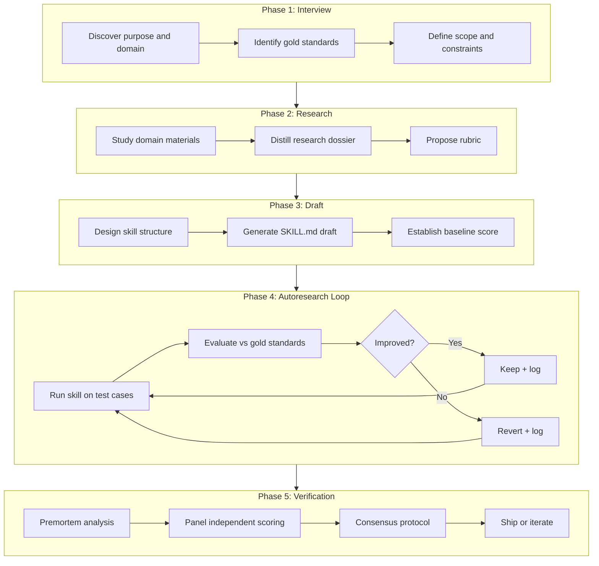
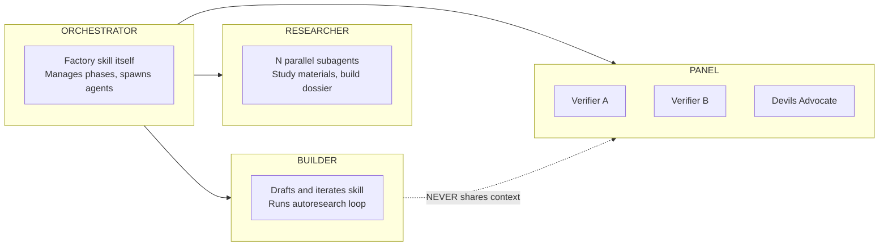

# create-skill-autoresearch: Skill Creation Factory

A Cursor agent skill that forges production-grade skills through gold-standard-driven autoresearch, multi-agent verification, and structured consensus. Built incrementally in 4 phases.

## Architecture



## Agent Roles



Key constraint: BUILDER and PANEL never share context. Panel receives only: skill output + gold standards + rubric. No bias from the building process.

## Locked Design Decisions (D1-D18)

All decisions documented in [docs/thoughts/07-design-questions.md](docs/thoughts/07-design-questions.md). Key ones:

- **D4**: 4-role agent topology (Orchestrator, Researcher, Builder, Panel)
- **D5**: Structured consensus with synthesis round and escalation
- **D7**: Two-tier loop budget (per-session + score threshold + plateau detection)
- **D8**: Shipped skill package vs process artifacts split
- **D13**: Adaptive data split (70/20/10 for 10+ cases, leave-one-out for fewer)
- **D17**: Invoke premortem/handoff skills; **enhance then call** autoresearch skill (not embed); follow production-grade/create-skill conventions
- **D18**: Incremental build in 5 phases (Phase 0: enhance autoresearch skill, then Phases 1-4)

## File Structure

```
AGENTS.md                     # Agent-facing project context
README.md                     # Human-facing project overview and quick start

.agents/skills/create-skill-autoresearch/
  SKILL.md                    # The factory skill (< 500 lines)
  references/
    pipeline-phases.md        # Detailed phase instructions
    rubric-templates.md       # Universal + domain rubric templates
    consensus-protocol.md     # Panel scoring and consensus rules

docs/
  usage-guide.md              # End-to-end walkthrough for users
  architecture.md             # Design overview with diagrams
  reference/
    rubric-format.md          # Rubric YAML schema and scoring
    metric-protocol.md        # METRIC line format, ASI, evaluate.sh contract
    workspace-layout.md       # Per-build workspace structure explained
  thoughts/                   # Research notes (internal, not user-facing)
  study/                      # Case study materials
  resources/                  # External reference implementations
```

### Workspace created per skill build

```
<workspace>/
  research/                   # Dossier -- study notes, distilled materials
  gold-standards/             # Input/output pairs or reference artifacts
  evaluation/
    rubric.yaml               # Scored dimensions with weights
    evaluate.sh               # Runner: METRIC lines output
    evaluate-checks.sh        # Optional correctness gate
  experiments/
    autoresearch.md           # Session contract
    autoresearch.jsonl         # Machine log (config + runs + ASI)
    results.tsv               # Human-readable journal
    craft-decisions.md        # DNN ledger
  skill/                      # The shipped artifact
    <skill-name>/
      SKILL.md
      references/             # If needed
  handoffs/                   # Context preservation
    state.yaml                # Structured resume state
    HANDOFF-*.md              # Rich handoff documents
```

## Build Phases

### Phase 0 -- Enhance Autoresearch Skill

First, upgrade [`.agents/skills/autoresearch/SKILL.md`](.agents/skills/autoresearch/SKILL.md) with battle-tested patterns from [`docs/resources/pi-autoresearch`](docs/resources/pi-autoresearch). This benefits ALL skill users, not just the factory.

**Enhancements to port from pi-autoresearch:**

- **METRIC protocol**: `METRIC name=value` line format for deterministic multi-metric parsing (replaces regex extraction)
- **ASI fields**: `hypothesis`, `rollback_reason`, `next_action_hint`, `learned` in every experiment log entry
- **Session contract**: `autoresearch.md` session document with goal, metric command, primary metric, budget
- **Machine log**: `autoresearch.jsonl` for structured experiment data alongside human-readable `results.tsv`
- **checks.sh**: Optional correctness gate (`autoresearch.checks.sh`) that must pass before measuring
- **Decide-first git model**: Only `git add -A && git commit` on `keep`; revert on discard without polluting history
- **Confidence scoring**: MAD (Median Absolute Deviation) for noisy metrics; skip keep/discard if confidence too low
- **Ideas backlog**: `autoresearch.ideas.md` for parking deferred hypotheses
- **Finalize logic**: Group kept experiments for reviewable PR branches

**What stays from the current autoresearch skill:**

- Interactive setup questionnaire (goal, metric, scope, constraints)
- Simplicity policy and experiment strategy priorities
- run.log redirection for clean agent context
- THINK-EDIT-COMMIT-RUN-MEASURE-DECIDE-LOG cycle structure
- Plateau detection and budget enforcement

The result: an autoresearch skill that combines the *user experience* of the Cursor skill with the *engineering rigor* of pi-autoresearch.

### Phase 1 (MVP) -- Core Pipeline

Build the end-to-end pipeline with a single LLM judge. This gets a working factory that can produce skills.

**Files to create:**

- [`.agents/skills/create-skill-autoresearch/SKILL.md`](.agents/skills/create-skill-autoresearch/SKILL.md) -- the factory skill, following create-skill conventions (< 500 lines, third-person description with "Use when..." trigger, YAML frontmatter with `name` + `description`)

- [`.agents/skills/create-skill-autoresearch/references/pipeline-phases.md`](.agents/skills/create-skill-autoresearch/references/pipeline-phases.md) -- detailed instructions for each of the 5 phases

- [`.agents/skills/create-skill-autoresearch/references/rubric-templates.md`](.agents/skills/create-skill-autoresearch/references/rubric-templates.md) -- universal rubric dimensions + domain-specific templates

**Documentation and project files:**

- [`AGENTS.md`](AGENTS.md) -- agent-facing project context. Covers: project overview, setup commands, skill locations and descriptions, development conventions, testing instructions, how skills are structured.

- [`README.md`](README.md) -- update from current 1-liner to a proper project README:
  - What this repo is (skill creation factory + harness)
  - Quick start (how to invoke the factory skill)
  - Repository structure overview (`.agents/skills/`, `docs/study/`, `docs/resources/`, `docs/thoughts/`)
  - Links to detailed docs

- `docs/` user-facing documentation:
  - [`docs/usage-guide.md`](docs/usage-guide.md) -- end-to-end walkthrough of using the factory: prerequisites, invoking the skill, what the interview asks, what research produces, how autoresearch runs, what ships at the end. Include a concrete example flow.
  - [`docs/architecture.md`](docs/architecture.md) -- design overview with mermaid diagrams (reuse from plan), agent roles, phase pipeline, decision rationale. Links to [docs/thoughts/07-design-questions.md](docs/thoughts/07-design-questions.md) for full decision log.
  - [`docs/reference/rubric-format.md`](docs/reference/rubric-format.md) -- rubric YAML schema, universal dimensions, how to add domain-specific dimensions, scoring scales
  - [`docs/reference/metric-protocol.md`](docs/reference/metric-protocol.md) -- METRIC line format, ASI fields, evaluate.sh contract, checks.sh contract
  - [`docs/reference/workspace-layout.md`](docs/reference/workspace-layout.md) -- what the factory creates per skill build (research/, gold-standards/, evaluation/, experiments/, skill/, handoffs/)
  - Update [`docs/thoughts/README.md`](docs/thoughts/README.md) to include pointers to the new docs and note its role as research/study notes (separate from user-facing docs)

**SKILL.md body structure (target ~300 lines):**

1. Frontmatter: `name: create-skill-autoresearch`, description with WHAT + WHEN
2. "When to use" trigger list
3. Phase overview (1-paragraph each for 5 phases)
4. Phase 1 Interview: structured AskQuestion flow to discover purpose, gold standards, scope
5. Phase 2 Research: spawn N parallel researcher subagents, build dossier, propose rubric
6. Phase 3 Draft: design structure (DESIGN.md pattern from tokyo), generate SKILL.md, measure baseline
7. Phase 4 Autoresearch: **invoke the enhanced autoresearch skill** with factory-provided `evaluate.sh` (LLM-as-judge against gold standards using the rubric). The factory sets goal, metric command, primary metric, and budget -- autoresearch handles the loop.
8. Phase 5 Verify: single LLM judge scoring (Phase 2 multi-agent deferred)
9. Handoff rules: when to write state.yaml + HANDOFF.md
10. Output structure: what ships vs what stays

**Evaluation system:**
- Rubric YAML format: dimensions with name, weight, score criteria, scale (0-2 or 1-10)
- `evaluate.sh` contract: run skill on test case, emit `METRIC dimension=score` lines
- Single LLM judge with structured JSON output (6+ dimensions)
- Adaptive data split logic documented in autoresearch-protocol.md

**Key conventions to follow:**
- create-skill: frontmatter format, < 500 lines, progressive disclosure, one-level-deep links
- autoresearch: **called as a skill** (enhanced in Phase 0) -- factory provides the metric command, autoresearch handles the loop
- production-grade: plan-of-plans (R1), quality gates, self-verification

### Phase 2 -- Multi-Agent Verification

Add the Panel with structured consensus and devils advocate.

**Files to create/modify:**

- [`.agents/skills/create-skill-autoresearch/references/consensus-protocol.md`](.agents/skills/create-skill-autoresearch/references/consensus-protocol.md) -- Panel roles, scoring protocol, synthesis round, escalation rules

- Update `SKILL.md` Phase 5 to spawn Panel subagents

**Consensus protocol:**
1. Each panel member receives: skill SKILL.md + gold standards + rubric (NO builder context)
2. Independent scoring against rubric dimensions
3. Tolerance check: if all scores within 1 point, consensus reached
4. If disagreement: each writes 1-paragraph rationale
5. Synthesis round: panel sees all rationales, re-scores
6. Majority rules after synthesis; dissenting concerns logged in craft-decisions
7. Devils advocate: always looks for failure modes, can escalate to user

**Devils advocate prompt design (from grill-me study):**
- Homework first: read gold standards, rubric, skill output thoroughly
- Name 2-3 explicit branches per concern (not just "this is bad")
- Every rejection gets a one-line reason
- Cannot block consensus alone, but escalates to user if critical risk overruled
- Separate from premortem: devils advocate challenges quality, premortem challenges failure modes

### Phase 3 -- Advanced Features

- Plateau detection: stop after N experiments with improvement < judge variance
- Multi-judge: run 2-3 different LLM models as judges, aggregate scores
- 70/20/10 data split for 10+ gold standards
- Handoff/resume via state.yaml (structured YAML for automatic phase detection)
- Rich HANDOFF.md generation (following tokyo handoff template)
- `autoresearch.ideas.md` backlog for deferred hypotheses
- Confidence scoring (MAD from pi-autoresearch) for noisy metrics

### Phase 4 -- Self-Improvement

Run the factory on its own SKILL.md to validate and improve. Gold standards: the 6 case studies in `docs/study/` where skills were successfully built. Rubric: does the factory reproduce comparable quality to the manual process?

## Key Implementation Details

### METRIC Protocol (from pi-autoresearch, proven in prior real-world builds)

```
METRIC <name>=<value>    # one per line, at line start
METRIC quality_score=8.33
METRIC structure=9.0
METRIC coverage=7.5
```

Names: `[\w.]+`, values: finite numbers. Primary metric named in session config. Secondary metrics tracked for tradeoff visibility.

### ASI Fields (Actionable Side Information, from pi-autoresearch)

On every experiment log entry, require:
- `hypothesis`: what we thought would improve
- `rollback_reason`: why it was discarded (if discarded)
- `next_action_hint`: what to try next
- `learned`: insight that survives revert

This is the ONLY structured memory that survives a git revert.

### Rubric YAML Format

```yaml
dimensions:
  - name: coverage
    weight: 0.2
    scale: "0-2"
    criteria: "Every gold standard pattern appears in the skill output"
  - name: accuracy
    weight: 0.2
    scale: "0-2"
    criteria: "Instructions are technically correct and complete"
  # ... domain-specific dimensions added by factory
target_score: 0.85  # normalized 0-1
max_iterations: 20
plateau_window: 5   # stop after N experiments with no improvement
```

### Craft-Decisions Ledger Format (from tokyo v2)

```
DNN -- <decision title>
  Source: <evidence anchor>
  Tried: <what was attempted>
  Measured: <gate result>
  Kept: <yes/no -- what shipped>
```

### Integration with Existing Skills

- **autoresearch**: **called as a skill** in Phase 4. Enhanced in Phase 0 with pi-autoresearch patterns. Factory provides `evaluate.sh` (LLM-as-judge + rubric) as the metric command; autoresearch handles the loop, git workflow, logging, and plateau detection.
- **premortem**: invoked in Phase 5 before Panel scoring
- **handoff**: invoked when context fatigues (orchestrator detects high turn count)
- **production-grade**: principles followed (R1 plan-of-plans, R2 quality over quantity, R8 unified standards)
- **create-skill**: conventions followed (frontmatter, < 500 lines, progressive disclosure)
