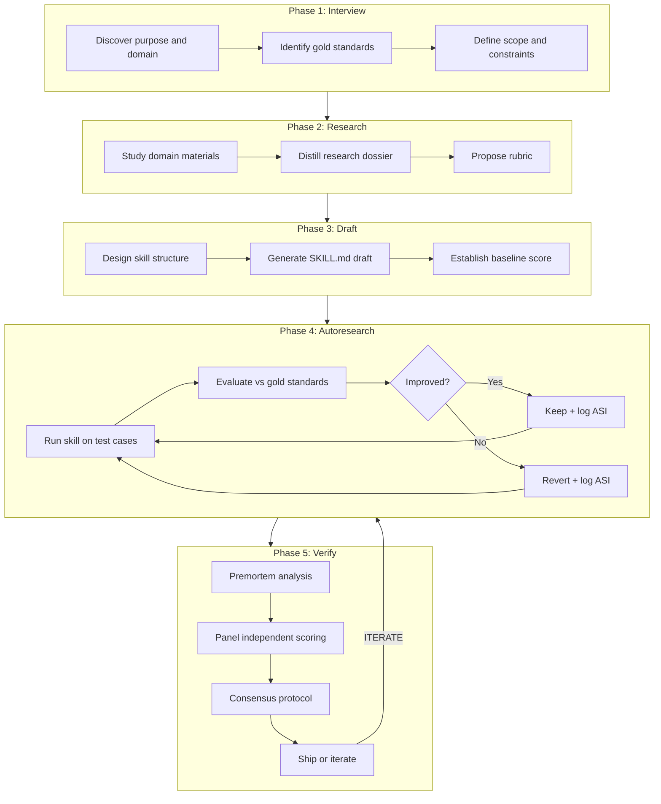
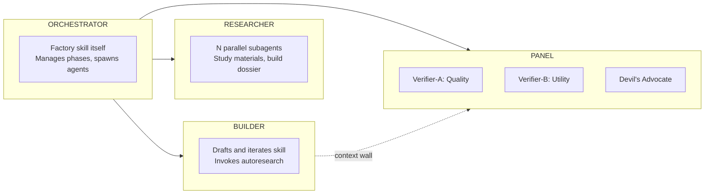
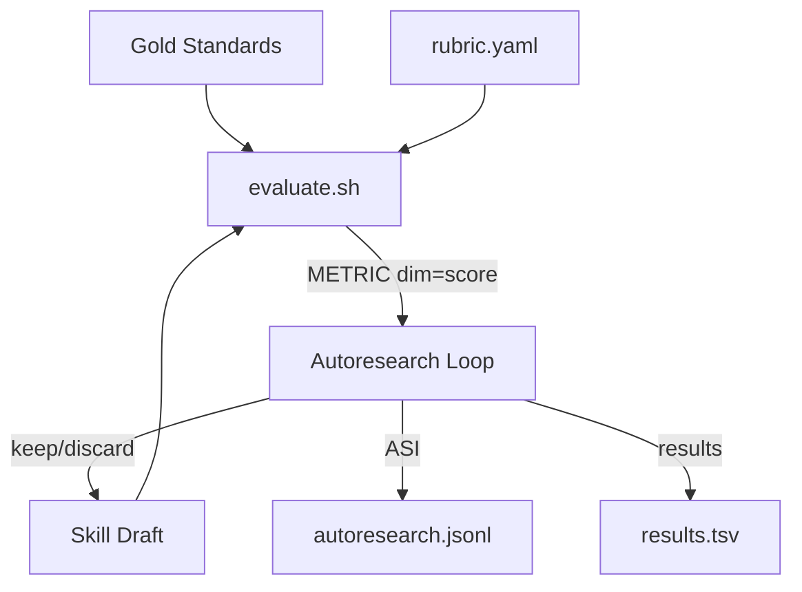
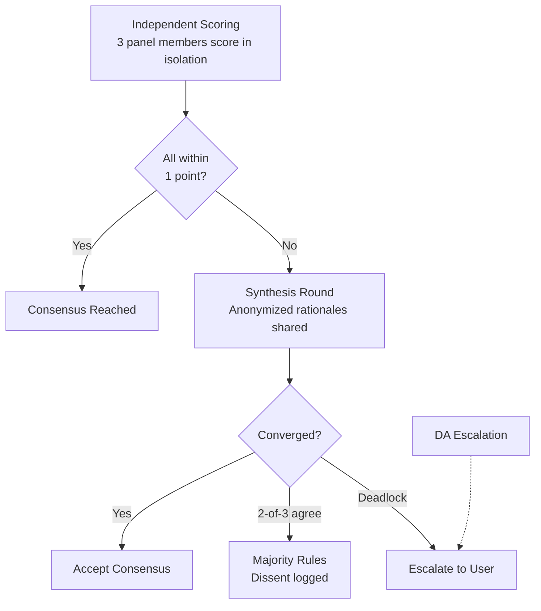
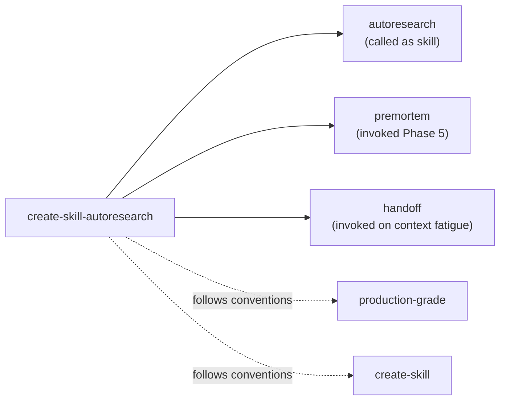

# Architecture

Design overview of the `create-skill-autoresearch` factory.

## Pipeline

The factory runs a 5-phase pipeline. Every successful skill build in our case studies followed this exact pattern, regardless of domain.

## Agent Roles

The factory orchestrates 4 distinct agent roles. The key architectural constraint is context isolation: the BUILDER and PANEL never share context, preventing bias.

| Role | What It Does | How It's Spawned |
|------|-------------|-----------------|
| ORCHESTRATOR | Manages phase transitions, spawns other roles, handles handoffs | The factory skill itself (the parent agent) |
| RESEARCHER | Studies domain materials, writes research notes | N parallel `explore` subagents |
| BUILDER | Drafts SKILL.md, runs autoresearch loop | Single subagent with autoresearch skill |
| PANEL | Independent verification and consensus | 3 parallel `generalPurpose` subagents |

## Evaluation Architecture

The evaluation pipeline:
1. `evaluate.sh` takes a gold standard test case as input
2. Runs the skill on the test case input
3. Uses an LLM-as-judge to compare output to the gold standard reference
4. Scores each rubric dimension independently
5. Emits `METRIC <dimension>=<score>` lines for the autoresearch skill to parse

## Consensus Protocol

The verification panel uses a structured protocol inspired by academic research on multi-agent deliberation.

Key design decisions:
- **Per-criterion atomic scoring** prevents halo effects (Autorubric research)
- **Evidence-anchoring** requires verbatim quotes for extreme scores (Rulers framework)
- **Explicit adversarial assignment** achieves 99.2% disagreement detection vs 48.3% for "think critically" (OpenReview research)
- **Single synthesis round** balances deliberation quality against token cost

## Skill Integration

| Skill | Integration Type | When |
|-------|-----------------|------|
| autoresearch | Called as dependency | Phase 4: provides the experimentation loop |
| premortem | Invoked directly | Phase 5: before panel evaluation |
| handoff | Invoked directly | When context fatigues or session ends |
| production-grade | Conventions followed | Throughout (plan-of-plans, quality gates) |
| create-skill | Conventions followed | Phase 3: SKILL.md structure and format |

## Design Decisions

All 18 locked design decisions are documented in [thoughts/07-design-questions.md](thoughts/07-design-questions.md). Key ones:

- **D4**: 4-role agent topology (Orchestrator, Researcher, Builder, Panel)
- **D5**: Structured consensus with synthesis round and escalation
- **D7**: Two-tier loop budget (per-session + score threshold + plateau detection)
- **D8**: Shipped skill package vs process artifacts split
- **D13**: Adaptive data split (70/20/10 for 10+ cases, leave-one-out for fewer)
- **D17**: Enhance then call autoresearch skill (not embed)
- **D18**: Incremental build in 5 phases

## Case Study Origins

Each factory component traces to a real-world case study:

| Component | Origin | Evidence |
|-----------|--------|----------|
| 5-phase pipeline | All case studies | Every build followed this pattern |
| METRIC protocol | Case studies + pi-autoresearch | Automated experiments proved it |
| Research dossier | tokyo skill | 19 research files, 10 parallel subagents |
| LLM-as-judge | Case studies | Deterministic scoring with rubrics |
| Panel consensus | Philosophy + research | Formalized from described approach |
| Handoff documents | tokyo skill | 2 cross-session handoffs preserved continuity |
| Craft-decisions ledger | tokyo v2 | 85+ DNN entries tracked every iteration |
